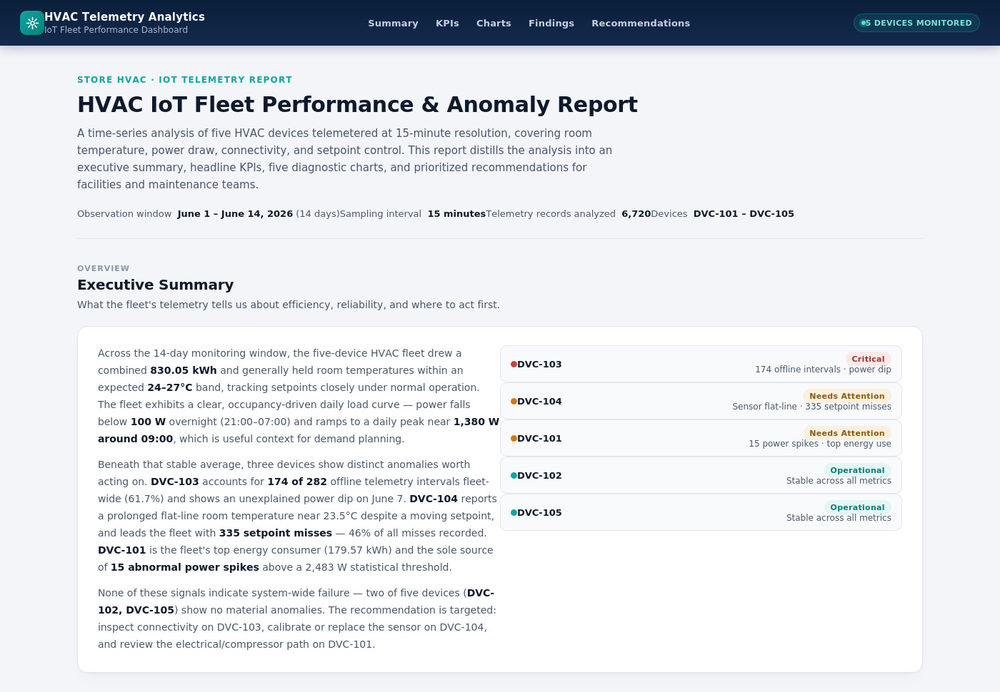
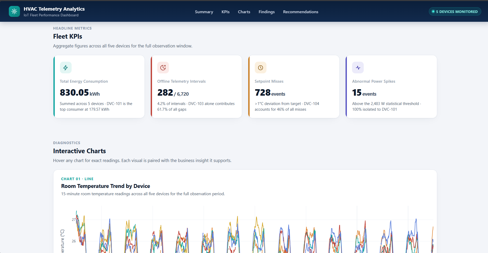

# 🌡️ HVAC IoT Telemetry Analytics — Fleet Performance & Anomaly Detection

[](https://www.python.org/)
[](https://pandas.pydata.org/)
[](https://plotly.com/python/)
[]()
[](LICENSE)

> End-to-end time-series analysis of IoT telemetry from a 5-device HVAC fleet — from raw sensor data to a decision-ready executive dashboard, delivering **root-cause anomaly detection** and **actionable maintenance recommendations**.

**🔗 [View the Live Interactive Dashboard](./HVAC_Analytics_Dashboard.html)** &nbsp;|&nbsp; **📓 [View the Full Analysis Notebook](./hvac_analysis.ipynb)**




---

## 📌 Project Overview

Commercial HVAC systems generate a constant stream of telemetry — temperature, power draw, compressor state — that most facilities never turn into action. I built this project to explore that gap: taking 14 days of raw, messy sensor data from a five-unit HVAC fleet and turning it into something a facilities team could actually act on — **clean it, understand it, and surface the issues worth a technician's attention.**

The result is a two-part deliverable that mirrors how this work gets handed off in practice:

1. **A fully documented Jupyter notebook** — the analytical process, decisions, and reasoning, cell by cell.
2. **A standalone HTML executive dashboard** — the polished, stakeholder-facing output, with zero dependencies to run.

## 🎯 Business Problem

A facilities team has 5 HVAC units reporting telemetry every 15 minutes across a 14-day window, but no way to answer:

- Are all devices operating normally, or is something quietly failing?
- Which devices are driving up the energy bill?
- Where should a maintenance technician be sent *first*?

This analysis turns **6,720+ raw telemetry records** into a fleet health report a non-technical stakeholder can act on in under two minutes.

## 🔍 Key Findings

| Device | Status | Issue Detected |
|---|---|---|
| 🔴 **DVC-103** | Critical | 174 of 282 fleet-wide offline intervals (61.7%) + unexplained power dip on Jun 7 — likely a connectivity fault |
| 🟠 **DVC-104** | Needs Attention | Prolonged flat-line temperature (~23.5°C) despite a changing setpoint + 335 setpoint misses (46% of all fleet misses) — likely sensor malfunction |
| 🟠 **DVC-101** | Needs Attention | Top energy consumer (179.57 kWh) and sole source of 15 statistical power spikes above threshold — likely electrical/compressor issue |
| 🟢 **DVC-102** | Operational | Stable across all metrics |
| 🟢 **DVC-105** | Operational | Stable across all metrics |

**Fleet-wide, across the 14-day window:**
- ⚡ **830.05 kWh** total energy consumption across 5 devices
- 📡 **282 / 6,720** telemetry intervals offline (4.2%), heavily concentrated in one device
- 🎯 **728** setpoint-deviation events (>1°C from target)
- 📈 Clear occupancy-driven load curve: power falls below 100 W overnight (21:00–07:00) and peaks near **1,380 W around 09:00**

➡️ **Bottom line:** 3 of 5 devices show distinct, independent anomalies (connectivity, sensor, electrical) — not a systemic fleet failure — pointing to three specific, targeted maintenance actions rather than a blanket inspection.

## 🛠️ Methodology

The analysis follows a complete, reproducible data pipeline:

**1. Data Cleaning & Preparation**
- Parsed timestamps, removed duplicates, and enforced chronological order per device
- Resampled every device to a uniform 15-minute grid to expose true communication gaps
- Flagged missing intervals as genuine **offline periods** (kept as `NaN`, never imputed) — distinguishing true telemetry outages from sensor error
- Isolated and corrected physically impossible sensor readings (e.g. -99°C, 85°C) via forward/backward fill *only* where valid data existed, without masking real outages

**2. Time-Series Aggregation**
- Built hourly and daily rollups (avg. temperature, avg. power, compressor runtime) per device to support both fine-grained and trend-level analysis

**3. Exploratory & Visual Analysis**
- Room temperature trends vs. setpoint, per-device power draw, and daily consumption profiles
- Peak vs. off-peak load curve to characterize occupancy-driven demand

**4. Anomaly Detection**
- Offline-interval counts per device (communication reliability)
- Flat-line / std-dev detection on temperature (sensor health)
- Statistical power-spike detection using a **mean + 3σ** threshold (electrical health)

**5. Business Metrics & Reporting**
- Estimated energy consumption (kWh) per device from power draw
- Setpoint-miss counting (>1°C deviation) as a proxy for control efficiency
- Synthesized findings into a KPI-driven executive dashboard with device-level status badges and prioritized recommendations

## 📊 The Dashboard

The `HVAC_Analytics_Dashboard.html` file is a **self-contained, standalone report** — open it directly in any browser, no server or dependencies required. It includes:

- An executive summary with fleet-wide narrative and per-device status badges
- Four headline KPI cards (energy, offline intervals, setpoint misses, top performer)
- Interactive Plotly charts (zoom, hover, filter by device) for every metric in the analysis
- A findings section and a prioritized, actionable recommendations list

## 📁 Repository Structure

```
hvac-iot-telemetry-analytics/
├── hvac_analysis.ipynb              # Full analysis notebook (cleaning → EDA → anomalies → insights)
├── HVAC_Analytics_Dashboard.html    # Standalone interactive executive dashboard
├── screenshots/
│   └── dashboard-preview.png        # Preview image used in this README
└── README.md                        # You are here
```

> **Note:** The source `device_telemetry.csv` (raw 15-minute telemetry from the 5-device fleet) is not redistributed in this repo. The notebook documents the exact cleaning and validation steps applied to it, so the pipeline is fully reproducible against any similarly structured telemetry export.

## 🧰 Tech Stack

- **Python** — pandas, NumPy for data wrangling and time-series resampling
- **Plotly Express / Graph Objects** — all interactive visualizations
- **Jupyter Notebook** — analysis environment and documentation
- **HTML / CSS** — custom-built dashboard shell (no frontend framework, no build step)

## 🚀 Running This Project

```bash
# Clone the repository
git clone https://github.com/Despo17/hvac-iot-telemetry-analytics.git
cd hvac-iot-telemetry-analytics

# Install dependencies
pip install pandas numpy plotly jupyter

# Launch the notebook
jupyter notebook hvac_analysis.ipynb
```

To view the dashboard, simply open `HVAC_Analytics_Dashboard.html` in any browser — no installation needed.

## 💡 What This Project Demonstrates

- Handling **messy, real-world IoT time-series data** — irregular intervals, sensor errors, and genuine outages that all need different treatment
- Turning raw exploratory analysis into a **clear, prioritized business narrative** rather than stopping at charts
- Building a **stakeholder-ready deliverable** (the dashboard) as a distinct artifact from the analytical working notebook
- Applying statistical anomaly detection (threshold-based, distribution-based) in a practical, explainable way

## 📬 Contact

**Abilash Sivakumar**
📧 abilashs315@gmail.com · 🔗 [LinkedIn](https://www.linkedin.com/in/abilash-s-b5594432a) · 💻 [GitHub](https://github.com/Despo17/)

---

⭐ If you found this project interesting, consider giving it a star!
